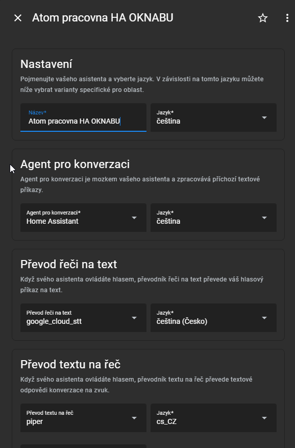
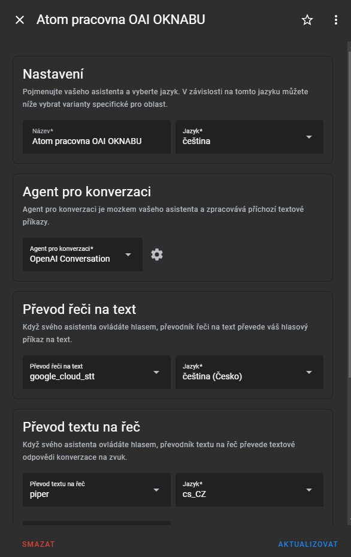
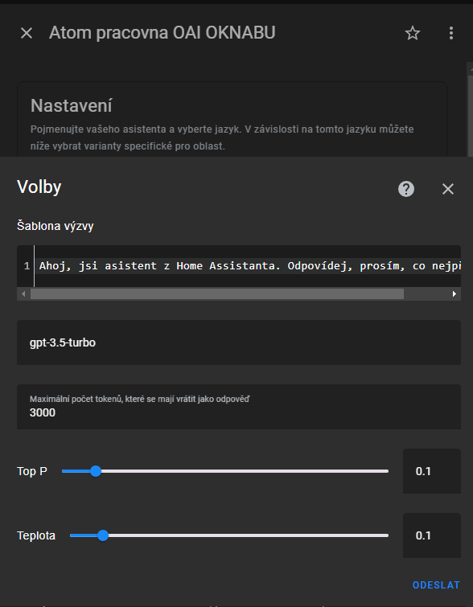

# Atoms for Girls

This is integration of multiple projects around Home Assistant to achieve (from google long promised) assistant in czech language.

## How it works
As I dont want to have OpenAI to controll my home, I configured 2 Assist pipelines:
1. pipeline for commanding Home Assistant
2. pipeline for answering questions from GPT-3.5 model

M5Stack Atom Echo listens for wake word and command, send it to Home Assistant Assist and Assist pipeline answers or controlls Home Assistant.

In my setup Atom Echo is only "smart" microphone and all sounds go out from Google Homes around house.

Atom's button long press triggers Assist pipeline change via automation.

## Video
Check [this video](https://youtu.be/tYFCeJbJb4A) for A4G in action

## Components used

- [Home Assistant](https://www.home-assistant.io/) & [Home Assistant Assist](https://www.home-assistant.io/voice_control/)
- [ESPhome](https://esphome.io/) (installed on [M5Stack Atom Echo](https://rpishop.cz/bloky/4379-m5stack-atom-echo-vyvojova-sada-pro-chytry-reproduktor.html))
- [OpenWakeWord](https://github.com/dscripka/openWakeWord) (for "OK Nabu" wake word)
- Home Assistant TTS & STS
- OpenAI conversation gpt-3.5-turbo

## Configuration

### Atom Echo ESPhome configuration
My small mod of https://github.com/esphome/firmware/blob/main/voice-assistant/m5stack-atom-echo.yaml find on [conf](conf) directory.

### Home Assistant configuration

#### Assist pipelines

#### scripts

on [conf](conf/scripts.yaml) directory.

#### automations

on [conf](conf/automations.yaml) directory.
