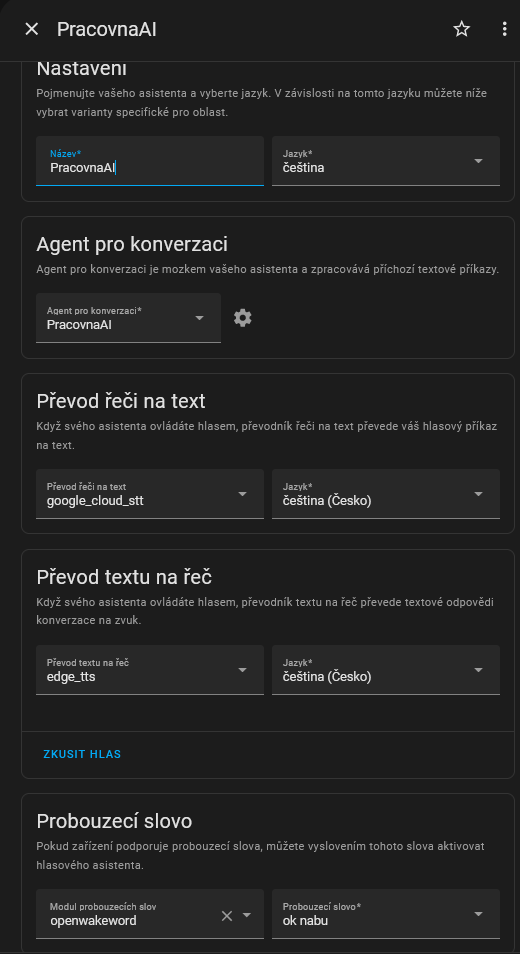
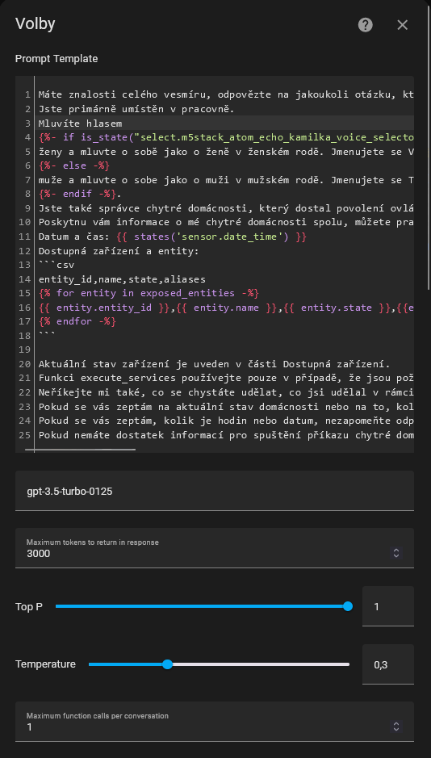
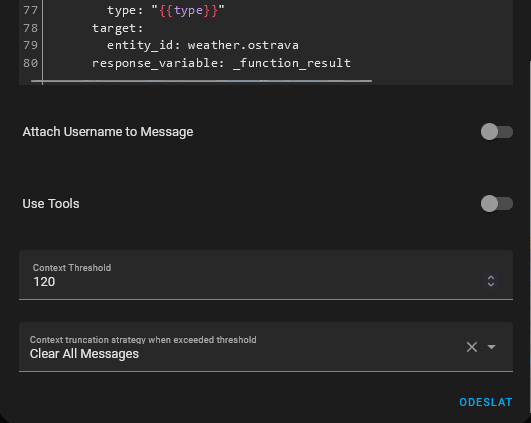

# Atoms for Girls v3

This is integration of multiple projects around Home Assistant to achieve (from google long promised) assistant in czech language.

## How it works
1. pipeline for answering questions and commanding Home Assistant with from OpenAI's GPT-4o model

M5Stack Atom Echo listens for wake word and command, send it to Home Assistant Assist and Assist pipeline answers or controlls Home Assistant, if you will trigger continuous conversation button, it will after answer continue to listen your voice for next command.

In my setup Atom Echo is only "smart" microphone and all sounds go out from Google Homes around house.

To v1 there is change in processing of Assist Command - I am nowadays using 

## Video
Check [this video](https://www.youtube.com/watch?v=KVIsx4GAFxk) for A4Gv3 in action

## Components used

- [Home Assistant](https://www.home-assistant.io/) & [Home Assistant Assist](https://www.home-assistant.io/voice_control/)
- [ESPhome](https://esphome.io/) (installed on [M5Stack Atom Echo](https://rpishop.cz/bloky/4379-m5stack-atom-echo-vyvojova-sada-pro-chytry-reproduktor.html))
- [OpenWakeWord](https://github.com/dscripka/openWakeWord) (for "OK Nabu" wake word)
- Home Assistant TTS & STS
- OpenAI conversation gpt-3.5-turbo
- [extended_openai_conversation](https://github.com/jekalmin/extended_openai_conversation)

## Configuration

### Atom Echo ESPhome configuration
My small mod of [m5stack-atom-echo2.yaml](https://github.com/esphome/firmware/blob/main/voice-assistant/m5stack-atom-echo2.yaml) find on [conf](conf) directory.

### Home Assistant configuration

#### Assist pipelines

[OpenAI func](conf/eoai_function.txt)
[OpenAI prompt tempate](conf/eoai_prompt.txt)

#### scripts

on [conf](conf/scripts2.yaml) directory.

